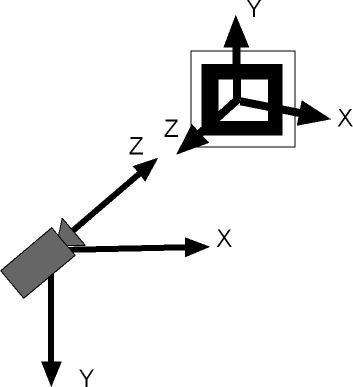

# python required
opencv-python  
opencv-contrib-python  
scipy  
cv_bridge  
```
pip install opencv-python opencv-contrib-python scipy cv_bridge
```
mavros  
```
sudo apt install ros-humble-mavros ros-humble-mavros-extras
wget https://raw.githubusercontent.com/mavlink/mavros/master/mavros/scripts/install_geographiclib_datasets.sh
chmod a+x install_geographiclib_datasets.sh
./install_geographiclib_datasets.sh
```

# 座標係(俯視圖)
## 飛控座標
x 軸: 前進為正，後退為負  
y 軸: 左移為正，右移為負  
z 軸: 上升為正，下降為負  
yaw: 順時針為正，逆時針為負

## marker 相機
以相機為原點
x 軸: 向右為正，向左為負  
y 軸: 向後為正，向前為負  
z 軸: 遠離為正，靠近為負  
yaw: 順時針為正，逆時針為負


# 飛行準備
1. 設定接口權限
2. 檢查底部相機旋轉角度
3. 檢查ＵＷＢ旋轉角度
4. 設定HOME位置
4. 執行flight_prepare.launch.py
## 啟動MAVROS
```
sudo chmod 777 /dev/ttyACM0
ros2 launch mavros apm.launch fcu_url:=/dev/ttyACM0
```
## 修改發布頻率
```
ros2 run mavros mav sys message-interval --id 24 --rate 100
ros2 run mavros mav sys message-interval --id 33 --rate 100
ros2 run mavros mav sys message-interval --id 132 --rate 100
```
## 飛行前準備launch
```
ros2 launch flight_control flight_prepare.launch.py
```